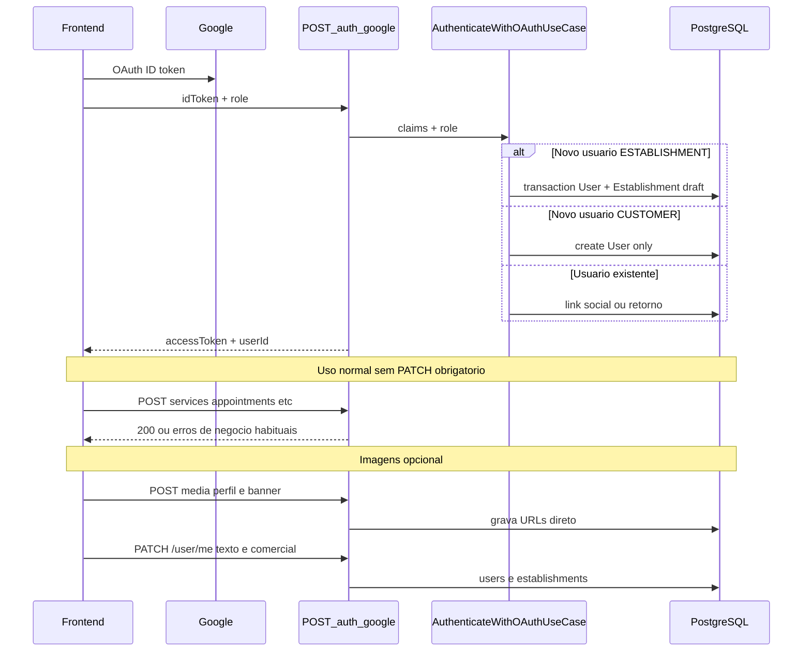

# OAuth Establishment + Perfil do Usuário — Plano de Implementação

> **For agentic workers:** REQUIRED SUB-SKILL: Use superpowers:subagent-driven-development (recommended) or superpowers:executing-plans to implement this plan task-by-task. Steps use checkbox (`- [ ]`) syntax for tracking.

**Goal:** Cadastro via Google usa `role` enviado no body; quando `role === ESTABLISHMENT` e é **novo** usuário, criar também `Establishment` incompleto; foto de perfil no `User`; completar depois via `PATCH /user/me` (opcional, sem bloquear o sistema).

**Architecture:** Migration + domínio como antes. [`AuthenticateWithOAuthUseCase`](src/modules/application/use-cases/auth/authenticate-with-oauth.ts) mantém `roleForNewUser` vindo do controller (`body.role`); `User.create` com essa role; **somente** se `roleForNewUser === "ESTABLISHMENT"`, transação cria `Establishment.createOAuthDraft()`. `role === "CUSTOMER"` → só `User` (comportamento atual do use case). [`PATCH /user/me`](src/infra/http/controllers/update-user.controller.ts) com `UpdateEstablishmentUseCase` quando dono envia bloco `establishment`.

**Tech Stack:** Node.js 22, TypeScript, NestJS, Prisma 7, PostgreSQL, Zod, Vitest, Supertest.

**Salvar em:** [`docs/superpowers/plans/2026-06-02-oauth-establishment-onboarding.md`](docs/superpowers/plans/2026-06-02-oauth-establishment-onboarding.md)

---

## Decisões de produto (confirmadas)

| Tópico                              | Decisão                                                                                                                                                                           |
| ----------------------------------- | --------------------------------------------------------------------------------------------------------------------------------------------------------------------------------- |
| Papel no OAuth Google               | Campo **`role` no body** (`CUSTOMER` \| `ESTABLISHMENT`); repassado como `roleForNewUser` ao use case                                                                             |
| Primeiro login `ESTABLISHMENT`      | `User` mínimo + `Establishment` com campos comerciais `null`                                                                                                                      |
| Primeiro login `CUSTOMER`           | Apenas `User` mínimo (sem linha em `establishments`)                                                                                                                              |
| Imagens                             | **POST `media` grava direto no banco** (igual banner): arquivo → S3/R2 → `users.profile_image_url` / `establishments.banner_image_url`                                            |
| `PATCH /user/me`                    | Só **dados textuais/comerciais** (`name`, `phone`, `address`, `establishment.tradeName`, etc.) — **sem** `profileImageUrl` nem `bannerImageUrl`                                   |
| OAuth                               | Imagens `null`; **não** usar foto do Google                                                                                                                                       |
| Completar cadastro                  | Opcional: POST upload(s) para fotos + `PATCH` para o restante                                                                                                                     |
| Pré-requisito mídia                 | Rota POST de avatar do **dono** deve persistir em `users.profile_image_url` no upload (mesmo padrão de `ESTABLISHMENT_BANNER`); alinhar no módulo `media` se ainda não fizer isso |
| `PATCH /user/me`                    | **Novo controller**; **pelo menos um** campo válido (senão `400`)                                                                                                                 |
| Bloqueio por cadastro incompleto    | **Não** — todas as rotas operacionais seguem acessíveis                                                                                                                           |
| Flag `establishmentProfileComplete` | **Não** — API não expõe status de completude; frontend infere dos campos se precisar                                                                                              |
| Registro clássico                   | [`RegisterEstablishmentUseCase`](src/modules/application/use-cases/establishment/register-establishment.ts) continua exigindo todos os campos                                     |

---

## Fluxo alvo



---

## Escopo e limites

**Incluído:** migration, domínio, OAuth, `profileImageUrl` em `User`, `PATCH /user/me` (só texto/comercial), nullable-safe, testes.

**Fora de escopo:** URLs de imagem no PATCH; novas rotas POST neste PR (mídia já é do time); foto do Google; OAuth `EMPLOYEE` / `ADMIN`; guards/flags.

## Mídia (S3 / CDN — já existente no projeto)

O repositório **já** faz upload server-side via API compatível com S3 ([`S3ObjectStorageService`](src/infra/storage/s3-object-storage.service.ts)), com `AWS_S3_BUCKET`, `AWS_S3_ENDPOINT` (opcional — padrão para **Cloudflare R2** ou LocalStack) e URL pública em `AWS_S3_PUBLIC_BASE_URL` (CDN na frente do bucket). O use case central é [`UploadDomainImageUseCase`](src/modules/application/use-cases/media/upload-domain-image.ts).

**Rotas HTTP atuais (tag `media`):**

| Rota                                                 | Kind                   | Persiste em                       |
| ---------------------------------------------------- | ---------------------- | --------------------------------- |
| `POST /employees/:employeeId/profile-image`          | `EMPLOYEE_PROFILE`     | `employees.profile_image_url`     |
| `POST /customers/:customerId/profile-image`          | `CUSTOMER_PROFILE`     | `customers.profile_image_url`     |
| `POST /vehicles/:vehicleId/image`                    | `VEHICLE`              | `customer_vehicles.image_url`     |
| `POST /establishments/:establishmentId/banner-image` | `ESTABLISHMENT_BANNER` | `establishments.banner_image_url` |

**Padrão único (recomendado):** igual ao banner — o **POST de upload já persiste** a URL; o front usa `{ url }` só para preview/UI, **não** precisa reenviar link no PATCH.

| Imagem         | POST (arquivo)                                                              | PATCH                       |
| -------------- | --------------------------------------------------------------------------- | --------------------------- |
| Banner         | `POST /establishments/:id/banner-image` → `establishments.banner_image_url` | Não envia `bannerImageUrl`  |
| Perfil do dono | Rota `media` do usuário → `users.profile_image_url`                         | Não envia `profileImageUrl` |

**Fluxo no front:** (1) POST perfil e/ou banner se o usuário escolheu foto; (2) `PATCH /user/me` com nome, telefone, CNPJ, etc.

**Este plano OAuth:** garante coluna `users.profile_image_url` e domínio `User.profileImageUrl`. Se a rota POST de upload do dono ainda grava em outro lugar (ex. antigo `establishments.profile_image_url`), **ajustar no módulo `media`** para gravar em `User` — fora do escopo do PATCH, mas pré-requisito de produto.

**OAuth:** imagens `null` no login.

**Explicitamente removido (vs. versões anteriores):** guards, `establishmentProfileComplete` / `isEstablishmentProfileComplete()`, 403 por cadastro incompleto.

---

## File Structure

**Criar:**

- `prisma/migrations/..._oauth_establishment_and_user_profile/migration.sql`
- `src/modules/establishments/domain/errors/invalid-update-establishment-input-error.ts`
- `src/modules/application/use-cases/establishment/update-establishment.ts`
- `src/modules/application/use-cases/establishment/update-establishment.spec.ts`
- `src/infra/http/controllers/update-user.controller.ts`
- `src/infra/http/controllers/update-user.controller.e2e-spec.ts`
- `src/modules/establishments/domain/entities/establishment.spec.ts` (se não existir)

**Modificar:**

- [`prisma/schema.prisma`](prisma/schema.prisma) — `User.profileImageUrl`; `Establishment` campos nullable; remover `profileImageUrl` de establishment
- [`src/modules/establishments/domain/entities/establishment.ts`](src/modules/establishments/domain/entities/establishment.ts)
- [`src/modules/accounts/domain/entities/user.ts`](src/modules/accounts/domain/entities/user.ts)
- [`src/modules/application/use-cases/auth/authenticate-with-oauth.ts`](src/modules/application/use-cases/auth/authenticate-with-oauth.ts) + spec
- [`src/infra/http/controllers/authenticate-with-google.controller.ts`](src/infra/http/controllers/authenticate-with-google.controller.ts) + e2e — body `idToken` + `role`
- [`src/infra/http/docs/auth-swagger.dto.ts`](src/infra/http/docs/auth-swagger.dto.ts) — `AuthenticateWithGoogleBodyDto.role`
- [`src/infra/database/prisma/mappers/prisma-user-mapper.ts`](src/infra/database/prisma/mappers/prisma-user-mapper.ts)
- [`src/infra/database/prisma/mappers/prisma-establishment-mapper.ts`](src/infra/database/prisma/mappers/prisma-establishment-mapper.ts)
- [`src/infra/database/prisma/repositories/prisma-users-repository.ts`](src/infra/database/prisma/repositories/prisma-users-repository.ts)
- [`src/modules/application/use-cases/user/update-user.ts`](src/modules/application/use-cases/user/update-user.ts) + spec
- [`src/infra/http/presenters/user-presenter.ts`](src/infra/http/presenters/user-presenter.ts)
- [`src/infra/http/docs/user-swagger.dto.ts`](src/infra/http/docs/user-swagger.dto.ts)
- [`src/infra/http/http.module.ts`](src/infra/http/http.module.ts)
- [`src/infra/database/seed.ts`](src/infra/database/seed.ts)
- [`tests/factories/establishment-factory.ts`](tests/factories/establishment-factory.ts)
- [`tests/repositories/in-memory-establishment-repository.ts`](tests/repositories/in-memory-establishment-repository.ts)
- Use cases com `establishment.cnpj.toString()` / `tradeName` — nullable-safe (ver Task 8)

---

## Task 1: Migration e schema Prisma

**Files:** `prisma/schema.prisma`, nova migration SQL

- [ ] **Step 1:** Em `User`, adicionar `profileImageUrl String? @map("profile_image_url")`.
- [ ] **Step 2:** Em `Establishment`, tornar nullable: `tradeName`, `legalBusinessName`, `slug`, `cnpj`; remover `profileImageUrl`.
- [ ] **Step 3:** Migration SQL:
  - `ALTER TABLE users ADD COLUMN profile_image_url TEXT;`
  - `UPDATE users u SET profile_image_url = e.profile_image_url FROM establishments e WHERE e.owner_id = u.id AND e.profile_image_url IS NOT NULL;`
  - `ALTER TABLE establishments` — drop `profile_image_url`; alterar colunas comerciais para nullable.
- [ ] **Step 4:** `npx prisma migrate dev` e regenerar client.

---

## Task 2: Domínio `Establishment`

**Files:** [`establishment.ts`](src/modules/establishments/domain/entities/establishment.ts), `establishment.spec.ts`

- [ ] **Step 1:** Alterar `EstablishmentProps`: campos comerciais nullable; remover `profileImageUrl`.
- [ ] **Step 2:** `createOAuthDraft({ ownerId })` com quatro campos `null`.
- [ ] **Step 3:** `updateCommercialProfile({ tradeName?, legalBusinessName?, cnpj?, slug? })` — merge parcial; validar VOs só nos campos enviados.
- [ ] **Step 4:** Ajustar `create` / `restore` / mapper.
- [ ] **Step 5:** Testes Vitest (draft + update parcial, sem método de “completo”).

---

## Task 3: Domínio `User` + `profileImageUrl`

**Files:** [`user.ts`](src/modules/accounts/domain/entities/user.ts), `user.spec.ts`

- [ ] **Step 1–3:** `profileImageUrl` em props, `User.update()`, testes.

---

## Task 4: `AuthenticateWithOAuthUseCase`

**Files:** [`authenticate-with-oauth.ts`](src/modules/application/use-cases/auth/authenticate-with-oauth.ts), [`authenticate-with-oauth.spec.ts`](src/modules/application/use-cases/auth/authenticate-with-oauth.spec.ts)

- [ ] **Step 1:** Manter `roleForNewUser?: UserRole` no request (não remover).
- [ ] **Step 2:** Injetar `EstablishmentsRepository` + `UnitOfWork`.
- [ ] **Step 3:** Novo usuário: `role: roleForNewUser ?? "CUSTOMER"` (default alinhado ao código atual).
- [ ] **Step 4:** Se `role === "ESTABLISHMENT"`, transação `create(user)` + `create(createOAuthDraft)`; senão só `create(user)`.
- [ ] **Step 5:** Novo usuário sempre com `profileImageUrl: null` (não receber foto do Google).
- [ ] **Step 6:** Specs: novo `ESTABLISHMENT` → user + establishment; novo `CUSTOMER` → só user; link por email não cria establishment.

---

## Task 5: Google OAuth + controller (`role` no body)

**Files:** verificador Google, [`authenticate-with-google.controller.ts`](src/infra/http/controllers/authenticate-with-google.controller.ts), e2e, auth swagger

- [ ] **Step 1:** Estender schema do body (strict):

```ts
const authenticateWithGoogleBodySchema = z
  .object({
    idToken: z.string().trim().min(1),
    role: z.enum(["CUSTOMER", "ESTABLISHMENT"]),
  })
  .strict();
```

- [ ] **Step 2:** Controller passa `roleForNewUser: body.role` para o use case.
- [ ] **Step 3:** **Não** mapear `payload.picture` em [`google-id-token-verifier.ts`](src/infra/auth/google-id-token-verifier.ts) nem repassar ao use case.
- [ ] **Step 4:** Swagger — `AuthenticateWithGoogleBodyDto` com `role` enum documentado.
- [ ] **Step 5:** E2e: `{ idToken, role: "ESTABLISHMENT" }` → establishment draft + `users.profile_image_url` null; `{ idToken, role: "CUSTOMER" }` → sem establishment; omitir `role` → 400.

---

## Task 6: Mappers, repositórios e seed

**Files:** mappers, seed, factories

- [ ] **Step 1–4:** alinhamento Prisma/in-memory/seed.

---

## Task 7: Controller `PATCH /user/me` + use cases

**Files:**

- Create: [`src/infra/http/controllers/update-user.controller.ts`](src/infra/http/controllers/update-user.controller.ts)
- Create: [`src/infra/http/controllers/update-user.controller.e2e-spec.ts`](src/infra/http/controllers/update-user.controller.e2e-spec.ts)
- Modify: [`src/modules/application/use-cases/user/update-user.ts`](src/modules/application/use-cases/user/update-user.ts)
- Create: `src/modules/application/use-cases/establishment/update-establishment.ts` + spec
- Modify: [`src/infra/http/docs/user-swagger.dto.ts`](src/infra/http/docs/user-swagger.dto.ts), [`http.module.ts`](src/infra/http/http.module.ts)

**Sim — o plano inclui implementar o controller HTTP** (o use case `UpdateUserUseCase` já existe, mas **não** há rota exposta hoje).

- [ ] **Step 1:** `UpdateUserUseCase` — **sem** `profileImageUrl` no request (foto só via POST `media`).

- [ ] **Step 2:** `UpdateEstablishmentUseCase` — `tradeName`, `legalBusinessName`, `cnpj`, `slug` apenas; **sem** `bannerImageUrl` (banner só via POST `media`).

- [ ] **Step 3:** `UpdateUserController` — `PATCH /user/me`, autenticado (`@CurrentUser`), `ZodValidationPipe` **strict**:

```ts
const updateUserBodySchema = z
  .object({
    name: z.string().trim().min(1).optional(),
    email: z.string().email().optional(),
    phone: z.string().trim().min(1).optional(),
    address: addressSchema.optional(),
    establishment: z
      .object({
        tradeName: z.string().trim().min(1).optional(),
        legalBusinessName: z.string().trim().min(1).optional(),
        cnpj: z.string().trim().min(1).optional(),
        slug: z.string().trim().min(1).optional(),
      })
      .strict()
      .optional(),
  })
  .strict()
  .refine(
    (body) => {
      const { establishment, ...userFields } = body;
      const hasUserField = Object.values(userFields).some(
        (v) => v !== undefined,
      );
      const hasEstablishmentField =
        establishment !== undefined &&
        Object.values(establishment).some((v) => v !== undefined);
      return hasUserField || hasEstablishmentField;
    },
    { message: "At least one field must be provided for update." },
  );
```

- Body vazio `{}` ou só chaves desconhecidas → **400** `BadRequestException`.
- `establishment: {}` sem nenhum subcampo → **400** (não conta como update).
- Orquestração: campos de usuário → `UpdateUserUseCase`; subcampos de `establishment` + `role === ESTABLISHMENT` → `UpdateEstablishmentUseCase`.
- Rejeitar `profileImageUrl` / `bannerImageUrl` no body (`.strict()` → 400 se o front enviar por engano).
- `CUSTOMER` com `establishment` no body → **400** ou ignorar bloco (recomendado: **400** strict).
- Resposta **200:** `{ user: UserPresenter.toHTTP(...) }`.

- [ ] **Step 4:** Swagger — `UpdateUserBodyDto`, documentar regra “pelo menos um campo”.

- [ ] **Step 5:** Registrar controller + use cases em [`http.module.ts`](src/infra/http/http.module.ts).

- [ ] **Step 6:** E2e em `update-user.controller.e2e-spec.ts`:
  - `PATCH /user/me` com `{ name: "Novo" }` → 200.
  - `PATCH` com `{ profileImageUrl: "..." }` → **400** (strict).
  - `{}` → 400.
  - `{ establishment: {} }` → 400.
  - `{ unknown: 1 }` (strict) → 400.

---

## Task 8: Nullable-safe nos use cases (sem bloqueio)

**Files:** ex. [`create-quote.ts`](src/modules/application/use-cases/quote/create-quote.ts), listagens que exibem nome da loja, PDF/snapshot helpers

- [ ] **Step 1:** Grep por `establishment.tradeName`, `establishment.cnpj`, `legalBusinessName`, `slug.value` e ajustar para nullable:
  - Snapshots (quotes): usar fallback (`tradeName ?? user.name`, `cnpj ?? ""` ou `null` no snapshot conforme schema de `Quote`) — **não** retornar erro por incompleto.
  - Respostas HTTP: expor `null` onde fizer sentido.
- [ ] **Step 2:** `EstablishmentScopeService` — **sem** `requireCompleteProfile`; OAuth `ESTABLISHMENT` tem registro após primeiro login; `CUSTOMER` continua sem establishment.
- [ ] **Step 3:** Testes: `create-service` / `create-quote` com establishment draft devem **passar** (não esperar 403).
- [ ] **Step 4:** Helpers e2e `makeEstablishmentUserWithoutProfileAuth`: evoluir para usuário com establishment draft (campos null) em vez de ausência de linha — expectativa **200** nas rotas operacionais, não 404/403 por perfil incompleto.

---

## Task 9: Limpeza e regressão

- [ ] **Step 1:** Remover `setProfileImageUrl` de `Establishment`; grep e corrigir referências.
- [ ] **Step 2:** `GetMe` / `UserPresenter` expõem `profileImageUrl` (campos comerciais do establishment ficam fora de `GET /user/me` nesta v1, salvo se o produto pedir bloco `establishment` depois).
- [ ] **Step 3:** Suite de testes completa.
- [ ] **Step 4:** Commits: `feat: oauth establishment draft`, `feat: move profile image to user`, `feat: patch user me optional onboarding`.

---

## Riscos e mitigação

| Risco                                                      | Mitigação                                                                                 |
| ---------------------------------------------------------- | ----------------------------------------------------------------------------------------- |
| `establishment.cnpj.toString()` com `cnpj` null            | Nullable-safe + fallback no snapshot (Task 8), sem guard                                  |
| Usuário ESTABLISHMENT legado sem linha em `establishments` | Manter 404 só quando registro não existe; OAuth novo com `role: ESTABLISHMENT` cria draft |
| PDF/quote com dados comerciais vazios                      | Aceitável até usuário preencher; UI pode incentivar sem bloquear API                      |
| `slug` gerado de `tradeName` null                          | `createOAuthDraft` não gera slug até update                                               |

---

## Test plan (manual)

1. `POST /auth/google` `{ idToken, role: "ESTABLISHMENT" }` (novo) → 200 + establishment com campos comerciais null.
2. `POST /auth/google` `{ idToken, role: "CUSTOMER" }` (novo) → 200, sem linha em `establishments`.
3. `GET /user/me` após OAuth → `profileImageUrl: null`.
4. `POST` banner → `establishments.banner_image_url` preenchido sem PATCH.
5. `POST` avatar do usuário (rota `media`) → `users.profile_image_url` preenchido sem PATCH.
6. `PATCH` só com `tradeName` / `phone` → OK; imagens inalteradas se já subidas no POST.
7. `POST /services` com establishment draft → **200**.
8. `PATCH /user/me` `{}` → 400.

**Testes automatizados:** Not run até implementação.
